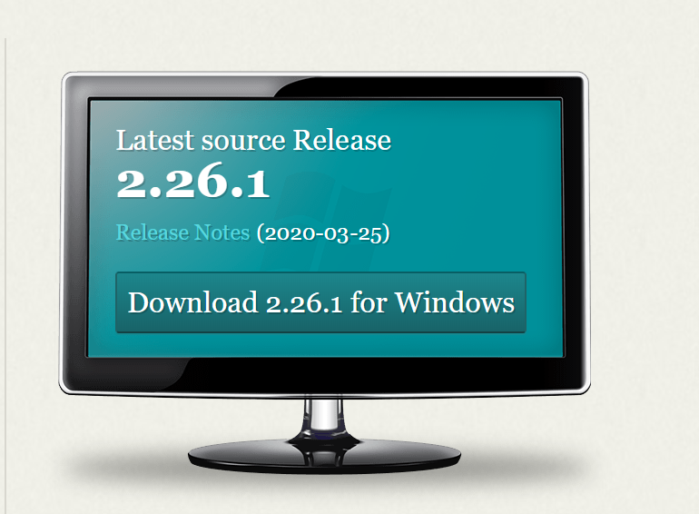
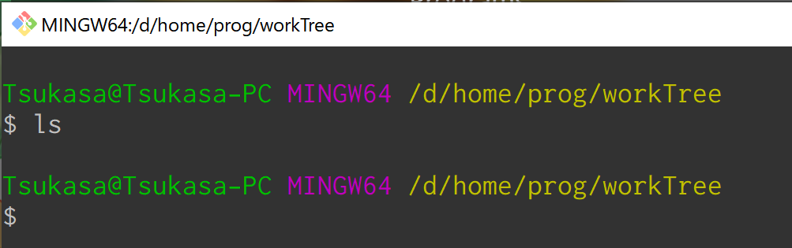

# localGit
急な自宅勤務によりGitのサーバと直接通信が出来なくなった時に、
自宅からでもGitと同期を取りながら作業を実施する方法を記載する。


# メリット
Gitでファイルを管理してくれるので、自宅でどのファイルを修正したかを
いちいち管理しなくても会社のファイルと同期することができる。

会社と自宅のファイル同期して「常に最新化」できる。


# 前提
- ファイルをGitで管理している
- 会社と自宅で大量のファイルを効率よく送受信する方法が確立している。

# 基本的な方針
実際に改修を実施するソースファイル(.cや.h)を送受信するのではなく、
Gitのリポジトリを会社と自宅間で送受信することによって、
改修を実施したファイルを「会社と自宅で同期する」

# Gitは分散型バージョン管理システム

Gitとは何かをググると、「分散型バージョン管理システム」という紹介文句が必ず登場する。

では、この「分散型」とはどういうことを意味するのか？

簡単に言えば、過去の全てのバージョン情報を格納しているリポジトリ「.git」が、
各自のファイルツリー内に存在しているという特徴が分散型システムの特徴である。

では、「分散型」のメリットは何か？

それは、「急な自宅勤務によりGitのサーバと直接通信が出来なくなった場合であっても、
会社で作業するのと全く同じ感覚で作業を進める」ことができるということである。

つまり、Gitの使い方さえ知っていれば、
会社だろうと、自宅だろうと、街中の喫茶店だろうが、
どこでも快適に作業を進めることができる。

# Gitのサーバはどこにでも立てることができる

通常、複数人の人で共有するリモートリポジトリは、
LinuxOSで構築したサーバ上に設置するのが一般的である。

しかし、これは、「Gitの特徴を考慮した結果、LinuxOS上にリモートリポジトリを設置している」のではなく、
「SSHやHTTPプロトコルを用いて、不特定多数の人がアクセス可能な場所を構築しようとした場合、
LinuxOSを使用した方が楽」という理由が主である。

不特定多数の人が簡単にアクセス出来るフォルダを構築できるのであれば、
リモートリポジトリを設置する場所は、LinuxOSだろうがWindowsOSだろうがmacOSだろうが何でもよい。


# Gitのインストール方法

インストーラーを自由に起動できる環境であれば、Gitのインストールは非常に楽。

## 1 Gitの公式ページに行ってインストーラーを取得
Gitのインストーラーは以下の公式ページに掲載されているので、ダウンロードして取得する。

https://git-scm.com/




## 2 インストーラーを起動してGitをインストール

インストーラーが取得出来たら、インストーラーを起動してGitのインストールを実施します。

基本的には、全てデフォルトのまま進んで行って貰えば問題ありません。

ひたすらYesやNextを連打してください。

## 3 Gitの初期設定用フォルダを作成

Gitのインストールが完了したら、Gitの初期設定を行います。

この初期設定は必ず実施してください。

社内のサーバとGit設定値を合わせる必要があります。
設定を行わないと、git commitコマンドの際に弾かれます。


Gitのコマンドラインを起動するため、
「適切な場所」に空のフォルダを作成します。

例 : C:/home/tmp

「適切な場所」とは、フォルダのフルパスに「日本語やスペース」が含まれない場所のことです。
これは、Gitに限った話ではありませんが、情報エンジニアなら、
フルパスの中に「日本語やスペース」が入っている時点で、
予期せぬエラーが発生する可能性が激増することは常識として知っておきましょう。  

どうしても、適当なフォルダが見つからない場合、
Cドライブ直下に「home」フォルダを作成して、その下に作業用フォルダを作成してください。

Cドライブ直下に、「home」フォルダを作成することは、
Linuxエンジニアでは、「常套手段」です。
(LinuxOSの場合、各ユーザのホームディレクトリが「/home」内に作られるため、
このフォルダ構成と同じにするのが、ある意味一般常識)


## 4 Gitの初期設定

初期設定用フォルダを用意したら、初期設定フォルダ内で、
右クリックを実施し、右クリックメニューを表示します。

Gitのインストールが完了している場合、
メニュー内に、「Git Bash Here」という項目が追加されているので、
それをクリックしてGitのコマンドラインを起動する。


コマンドラインが起動したら以下のコマンドをコピペして実行

``` bash
git config --global merge.ff false
git config --global pull.rebase true
git config --global core.autocrlf false
git config --global core.filemode false
git config --global color.ui auto
```

各コマンドの意味を1つ1つ説明していると非常に長くなってしまうため、ググって頂きたい。
なお、社内で使っているサーバでも、サーバ構築時に上記と同じコマンドを実行しました。

上記のコマンドが完了したら、続けて以下の2つのコマンドを実行する。

ただし、「あなたの名前」や「あなたのメールアドレス」は普段、自分が使用している名前やアドレスを設定すること。

``` bash
git config --global user.name "あなたの名前"
git config --global user.email "あなたのメールアドレス"
```

設定が全て完了したら、以下のコマンドを実行する。
``` bash
git config --list --global
```

設定した項目値が表示されるので、
以下の画像と同じようになっていれば、Gitの設定は完了。


Git初期設定用フォルダはもう使用しないため、削除して頂いてOK


# ベアリポジトリとノンベアリポジトリについて

普段自分が作業しているワークツリー内に存在しているリポジトリ「.git」をリモートリポジトリ化する手順を紹介する前に、Gitに関する知識を記載する。

「リモートリポジトリ化する」とはどういう意味かというと、
他のリポジトリからの「git push」や「git pull」を受付可能な状態にするという意味です。

ワークツリー内に存在するリポジトリ「.git」とサーバ上に存在するリモートリポジトリは、完全に同じものです。

ただし、リポジトリには、以下の2種類に分類されます。
- リポジトリの周りにワークツリーが存在する「non-bare リポジトリ」[core.bare=false]。  
ユーザが作業を行うワークツリーフォルダ内に存在するリポジトリはこのタイプ。  
外部からのpushやpullは受け付けない。
- リポジトリの周りにワークツリーが存在しない「bareリポジトリ」[core.bare=true]。  
GitLabサーバ内に存在するリポジトリはこのタイプ(通常見えません)。  
外部からの「git push」や「git pull」を受け付ける。

試しに、既存のワークツリー内で以下のコマンドを実行してみましょう。
``` bash
git config --list --local
```
以下の画像のように、「core.bare」値がfalseとなっており、
ワークツリー内のリポジトリが「non-bareリポジトリ」であることが確認できます。


「リモートリポジトリ化する」とは、つまり、
「ノンベアリポジトリをベアリポジトリに切り替える」ことです。


補足:  
「bare」の日本語訳は「裸の」や「剥き出しの」という意味。  
昔、中学校の理科の時間で習った、「被子植物(non-bare plant)」や「裸子植物(bare plant)」のイメージ。


# リモートリポジトリ化する手順

リモートリポジトリを作成する具体的な手順を記載する。

## 1 リモートリポジトリを配置するサーバ用フォルダを作成する


Gitのリモートリポジトリを配置するための
「適切なフォルダ」(以下、サーバー用フォルダ)を作成します。

例 : C:/home/GitServer

## 2 既存のリポジトリをサーバー用フォルダにコピー

既存のワークツリーのフォルダを開き、  
その中に存在するリポジトリフォルダ「.git」をサーバー用フォルダへコピーします。


補足:  
リポジトリフォルダ「.git」が表示されていない場合の対応方法。  
一般的にドット(.)から始まるファイルやフォルダは、「隠しファイル」として扱われるため、
OSの設定によって表示されません。仮に表示されない場合、設定を変更してください。
変更方法は、「隠しフォルダ 表示」とググれば出てきます。

## 3 リポジトリの名前をリネーム

リポジトリの名前がコピーが完了したら、コピーしたリポジトリの名前を変更します。

変更後の名前は、「〇〇〇.git」としてください。   
Gitのリポジトリフォルダ名は、必ず最後が「.git」とするのが、慣例とされています(多分、常識)。  


## 4 リネームしたリポジトリ内でGitのコマンドラインを開く

フォルダのリネームが完了したら、フォルダを開いて、  
「右クリック」→「Git Bash Here」


## 5 リポジトリをベアリポジトリに切り替えるコマンドを実行

以下のコマンドを実行してリポジトリをベアリポジトリに切り替えてください。  
これで、git pullやgit pushを受け付けられるようになります。
``` bash
git config core.bare true
```


# 作成したベアリポジトリからgit clone

サーバーとして使用するベアリポジトリの用意ができたら、
実際にgit cloneでワークツリーを作成します。

ここで注意して欲しいのが、  
git cloneのデータ取得元のURL指定方法です。

以下の例のように変換してURLを指定する必要があります。
- パスの先頭に「file:///」と付ける
- フォルダの区切り文字「バックスラッシュ」を「スラッシュ」に置換する

```
C:\home\GitServer\dainas.git
↓
file:///C:/home/GitServer/dainas.git
```

## 1 ワークツリーとして使用するフォルダを用意する

「適切な空フォルダ」を作成してください。

## 2 作成した空フォルダ内でGitのコマンドラインを起動
「右クリック」→「Git Bash Here」



## 3 git cloneを実行

Git cloneを実行します。
上記のURLの変換に習って、ベアリポジトリのパスを指定してください。

例
``` bash
git clone file:///C:/home/GitServer/dainas.git .
```


これにより、Gitによるバージョン管理が行われているワークツリーを複製することができました。


# 社内 <-> 自宅手順

1. 既存のワークツリー内のリポジトリ「.git」を「適切なフォルダ」へコピー
1. コピーしたリポジトリの名前を「〇〇〇.git」へ変更
1. 名前を変更したリポジトリ内で以下のコマンドを実行  
git config core.bare true
1. リポジトリフォルダ「〇〇〇.git」を自宅転送用領域にアップデート
1. 自宅で「〇〇〇.git」を「適切なフォルダ」へ貸し出し
1. 貸し出ししたフォルダをURL指定してgit clone
1. git cloneで作成したワークツリー内で作業&git push
1. 自宅作業の最後に、貸し出ししていた「〇〇〇.git」を返却
1. 次に出社したタイミングで、「〇〇〇.git」を社内の適切なフォルダに貸し出し
1. 上記の手順で貸し出した「〇〇〇.git」内で、「git push」や「git pull」を実行して、本来のサーバーと同期。

